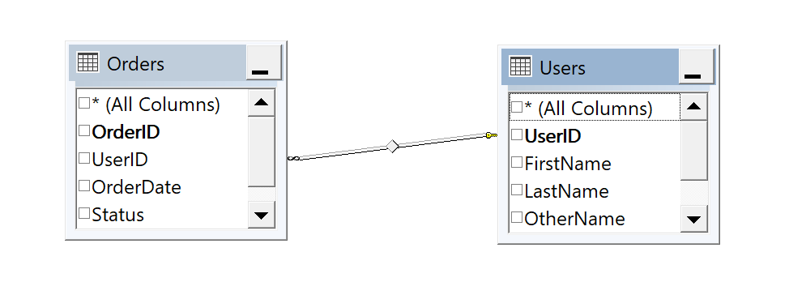
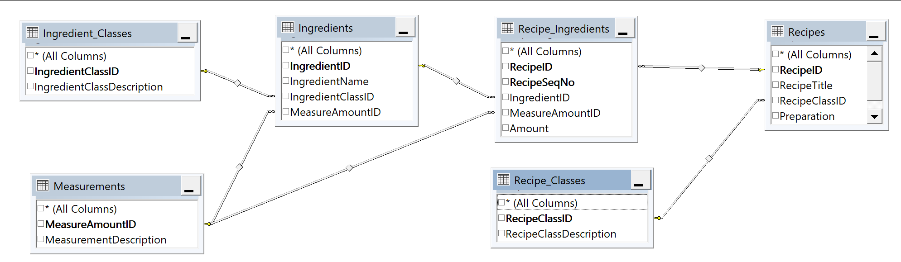

[prev](join) [next](outerjoin)
## 1.0 $\mathbb{I}$nner $\mathbb{J}$oins
<p align=center>
    
</p>

##### 1.1 $\mathbb{D}$efinition

 An ***`(INNER) JOIN  selects records rows that have matching values in both tables. It will exclude rows where no match is found in the join tables.`***
##### 1.2 $\mathbb{S}$yntax
Below we have a very simplified syntax demonstrating how to use the ***`(INNER) JOIN`*** operator in a query of two tables
```SQL
    SELECT <column_list> /* from any of the two tables */
    FROM table_one
        (INNER) JOIN table_two
            ON <search_condition>
        /* Using <column_name> */
```
#### 1.3 $\mathbb{S}et\ \mathbb{N}otation$
$$\forall\ row \in table\_one\ if\ \exist\ row_i\ \in table\_two\\ 
where\ search\_condition\ is\ True\ Return\\ row|table\_two.row_i.column\_names
$$


##### 1.4 $\mathbb{A}liases$
you can assign shorter ***`aliases`*** to your table names to make the queries more readable

$e.g$
```SQL
SELECT x.Column_name,
        y.Column_name
FROM tableX as x
        (INNER) JOIN tableY as y
        ON <search_condition>
        /* USING <column_name> */
```
##### 1.5 $\mathbb{E}xamples$
- Using our all familiar table from illustration lets get all the orders and
  their corresponding Users
  

Hey mr. Analyst, I need  a detailed list of all Orders, the Users who placed them, the date the order was made, status of each order and the the order value.
```SQL
SELECT Users.UserID,
        /* column expression */
	(Users.FirstName + ' ' 
	+ Users.LastName + ' ' 
	+ ISNULL(Users.OtherName, '')
	) AS Name,
/* Columns from the second table */
	Orders.OrderID,
	Orders.OrderDate, 
	Orders.Status,
	Orders.TotalAmount
FROM Users
	JOIN Orders
		ON Users.UserID = Orders.UserID
```
Alternatively we can alias the tables to make our query a little cleaner
```SQL
SELECT U.UserID,
	U.FirstName + ' ' + U.LastName + ' ' + ISNULL(U.OtherName, '') AS Name,
	O.OrderID,
	O.OrderDate, 
	O.Status,
	O.TotalAmount
FROM Users AS U
	JOIN Orders AS O
		ON U.UserID = O.UserID
```
- Show me the recipe title, preparation, and recipe class description of
all recipes in my database.
```SQL
SELECT RecipeTitle, Preparation,
RecipeClassDescription
FROM Recipe_Classes 
        INNER JOIN Recipes
        ON Recipe_Classes.RecipeClassID = Recipes.RecipeClassID
```
  #### 1.6 $\mathbb{E}$mbedding a $\mathbb{S}$ELECT $\mathbb{S}$tatement
```SQL
SELECT R.RecipeTitle, R.Preparation,
	RCFiltered.ClassName
FROM (
	/* We're about to form a logical table here */
	SELECT RecipeClassID,
			RecipeClassDescription AS ClassName
	FROM Recipe_Classes AS RC
	WHERE RC.RecipeClassDescription IN ('Main course', 'Dessert')
	) AS RCFiltered

	/* We're about to perform a inner join*/
	JOIN Recipes AS R
		ON RCFiltered.RecipeClassID = R.RecipeClassID
```
Note whenever you want to substitute a `SELECT` statement for a table
name, you must include both the columns you want to display and 
any linking column needed to perform `JOIN`. This feature however not permitted
in all Database management systems.

#### 1.7 $\mathbb{J}$oining more than two tables
  
  

Show me the names of all my recipes and the names of all the
ingredients for each of those recipes.
```SQL
SELECT Recipes.RecipeTitle,
        Ingredients.IngredientName
FROM (Recipes
        INNER JOIN Recipe_Ingredients
                ON Recipes.RecipeID = Recipe_Ingredients.RecipeID)
        INNER JOIN Ingredients
                ON Ingredients.IngredientID = Recipe_Ingredients.IngredientID
```

I need the recipe type, recipe name, preparation instructions,
ingredient names, ingredient step numbers, ingredient quantities, and
ingredient measurements from my recipes database, sorted in step
number sequence.

```SQL
SELECT Recipe_Classes.RecipeClassDescription,
        Recipes.RecipeTitle, Recipes.Preparation,
        Ingredients.IngredientName,
        Recipe_Ingredients.RecipeSeqNo,
        Recipe_Ingredients.Amount,
        Measurements.MeasurementDescription
FROM Recipe_Classes
        INNER JOIN Recipes
                ON Recipe_Classes.RecipeClassID = Recipe.RecipeClassID
        INNER JOIN Recipe_Ingredients
                ON Recipes.RecipeID = Recipe_Ingredients.RecipeID
        INNER JOIN Ingredients
                ON Ingredients.IngredientID = Recipe_Ingredients.IngredientID
        INNER JOIN Measurements
                ON Measurements.MeasureAmountID = Recipe_Ingredients.MeasureAmountID
ORDER BY RecipeTitle, RecipeSeqNo
```


##### 1.4 $\mathbb{K}ey points$
- Ideal for cases where you only want related information from multiple tables
- Filter out unmatched rows: rows that do not have corresponding matches are not included in the result set
- Data returned: only rows where you have corresponding matches between the tables involved are returned
##### 1.4 $\mathbb{Workout}$
Solve at least two 2 problems from each database in SQL Query for the mere mortals

[prev](join) [next](outerjoin)