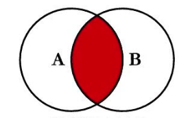

[next](innerJoins)
# Lesson 6.0 $\mathbb{T}he\  \mathbb{J}oin\ \mathbb{O}perators$

    

## 1.0 $\mathbb{O}verview$
A SQL Join is a clause that is used to combine rows from two or more tables based on a related column between them. Think of it like merging two tables(spreadsheets) based on a common column (e.g., "UserID"). Joins are essential to relational databases because data is typically split across multiple tables for normalization. Joins allow us to gather related data from these tables.
#### 1.1 $\mathbb{T}ypes\ of\ \mathbb{SQL}\ \mathbb{J}oins$

- Inner Join: Returns records that have matching values in both tables. It is the most commonly used join.
- Left (Outer) Join: Returns all records from the left table and the matched records from the right table. If there is no match, the result is NULL for the right table.
- Right (Outer) Join: Returns all records from the right table and the matched records from the left table. If there is no match, the result is NULL for the left table.
- Full (Outer) Join: Returns all records when there is a match in either the left or right table. If there is no match, NULL values are returned for non-matching rows.
- Cross Join: Returns the Cartesian product of both tables, meaning every row in the first table is paired with every row in the second table.

#### 1.2 $\mathbb{W}hy\ \mathbb{J}oins?$
- Data Normalization: In relational databases, data is divided into multiple tables to avoid redundancy (e.g., customer details in one table, orders in another). Joins allow you to combine these tables back together for analysis.
- Data Analysis: When performing queries for reporting or analysis, joins are necessary to get a complete picture from multiple tables.
- Data Retrieval: Joins provide a flexible way to retrieve data from related tables without duplicating data.

[next](innerJoins)
