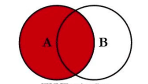
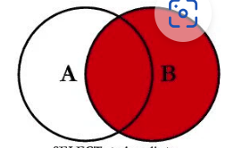
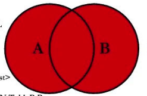

[prev](innerJoins)
## 2.0 $\mathbb{O}$uter $\mathbb{J}$OIN
#### 2.1 $\mathbb{D}$efinition

***`An OUTER JOIN return not only the rows that match the criteria you specify but also the unmatched rows from
either one or both of the two sets you want to link. NULLs are returned for rows where criteria isn't met`***
### $\mathbb{L}$eft $\mathbb{O}$uter $\mathbb{J}$oin

<p align=center>
    
</p>

##### 1.2 $\mathbb{S}$yntax
Let's take a look at the syntax of a ***`LEFT (OUTER) JOIN`*** below
```SQL
SELECT <column_list> /* from any of the two tables */
    FROM table_one
        LEFT (OUTER) JOIN table_two
        ON <search_condition>
        /* Using <column_name> */
```
##### 1.5 $\mathbb{E}xamples$
- Show me all the recipe types and any matching recipes in my
database
```SQL
SELECT Recipe_Classes.RecipeClassDescription,
		Recipes.RecipeTitle
FROM Recipe_Classes
	LEFT OUTER JOIN Recipes
		ON Recipe_Classes.RecipeClassID = Recipes.RecipeClassID
```

- Display the recipe classes that do not yet have any recipes.
```SQL
SELECT Recipe_Classes.RecipeClassDescription,
        Recipes.RecipeTitle
FROM Recipe_Classes
      LEFT OUTER JOIN Recipes
          ON Recipe_Classes.RecipeClassID = Recipes.RecipeClassID
WHERE Recipes.RecipeID IS NULL
```

- What products have never been ordered?
```SQL
SELECT Products.ProductNumber,
	Products.ProductName
FROM Products
	LEFT OUTER JOIN Order_Details
		ON Products.ProductNumber = Order_Details.ProductNumber
WHERE Order_Details.OrderNumber IS NULL
```

### $\mathbb{R}$ight $\mathbb{O}$uter $\mathbb{J}$oin

<p align=center>
    
</p>

##### 1.2 $\mathbb{S}$yntax
Let's take a look at the syntax of a ***`LEFT (OUTER) JOIN`*** below
```SQL
SELECT <column_list> /* from any of the two tables */
    FROM table_one
        RIGHT (OUTER) JOIN table_two
        ON <search_condition>
        /* Using <column_name> */
```
##### 1.4 $\mathbb{K}ey points$

### $\mathbb{F}$ull $\mathbb{O}$uter $\mathbb{J}$oin

<p align=center>
    
</p>

##### 1.2 $\mathbb{S}$yntax
Let's take a look at the syntax of a ***`LEFT (OUTER) JOIN`*** below
```SQL
SELECT <column_list> /* from any of the two tables */
    FROM table_one
        FULL (OUTER) JOIN table_two
        ON <search_condition>
        /* Using <column_name> */
```
### Union Join
### Applications
### Workout
### Summary
### query workout

[prev](innerJoins)