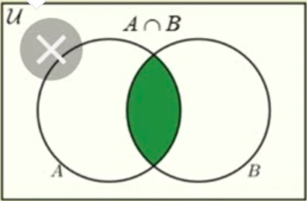
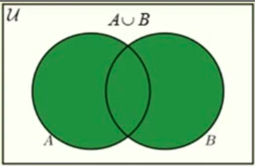
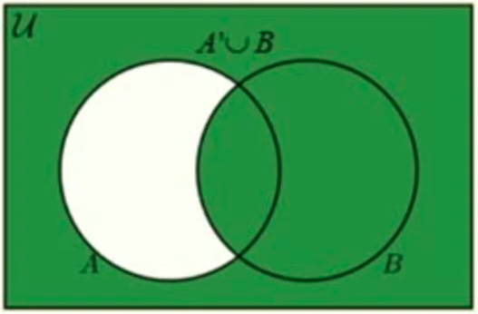

<div align=center>
    <h1>Lesson 5.0 Databases and SET operations</h1>
</div>

### Learning Objectives
- [Set operations](#set-operations)
  - [1. Interception](#1-interception)
    - [math example](#math-example)
    - [query example](#query-example)
    - [sample problems](#sample-problems)
  - [2. Union](#2-union)
    - [math examples](#math-examples)
    - [query examples](#query-examples)
    - [sample problems](#sample-problems-1)
  - [3. Difference (Except)](#3-difference-except)
    - [math exaple](#math-exaple)
    - [query example](#query-example-1)
    - [sample problems](#sample-problems-2)


### Definition:
$$A\ set\ is\ an\ unordered\ collection\ of\ distinct\ objects\ or\ elements.$$
## Set operations
### 1. Interception
<p align=center>
    
</p>

$$
An\ intersection\ of\ two\ sets\ contains\ the\ common\ elements\ of\ two\ sets.
$$

#### math example
$$
let\ \mathbb{X} = \{1, 5, 8, 8, 8, 32, 55, 78\},\ \mathbb{Y} = \{ 3, 7, 8, 22, 55, 71\}\\

then,\

\mathbb{X} \cap \mathbb{Y} = \{8, 55\}
$$

#### query example
```SQL
SELECT * FROM Orders
WHERE Status = 'Delivered'
INTERSECT
SELECT * FROM Orders
WHERE TotalAmount > 1000;
```

#### sample problems
- Show me customers and employees who have the same name.
- Find all the customers who ordered a bicycle and also ordered a
helmet.
- List the entertainers who played engagements for customers
Bonnicksen and Rosales.
- Show me the students who have an average score of 85 or better in Art
and who also have an average score of 85 or better in Computer
Science.
- Find the bowlers who had a raw score of 155 or better at both
Thunderbird Lanes and Bolero Lanes.
- Show me the recipes that have beef and garlic. 

### 2. Union
<p align=center>
    
</p>

$$
Union\ lets\ you\ combine\ two\ sets\ of\ similar\ information\ into\ one\ set.
$$
#### math examples

$$
let\ \mathbb{X} = \{1, 5, 8, 7, -8, 32, 55, 78\}\ and \ \mathbb{Y} = \{ 3, 7, 8, 22, 55, 71\}\\

then,\ 
\mathbb{X} \cup \mathbb{Y} = \{1, 5, 8, 32, 55, 78, 3, 7, 22, 71\}
$$

#### query examples
```SQL
SELECT * FROM Orders
WHERE Status = 'Delivered'
UNION
SELECT * FROM Orders
WHERE TotalAmount > 1000;
```
#### sample problems
- Show me all the customer and employee names and addresses.”
- List all the customers who ordered a bicycle combined with all the
customers who ordered a helmet.
- List the entertainers who played engagements for customer Bonnicksen
combined with all the entertainers who played engagements for
customer Rosales.
- Show me the students who have an average score of 85 or better in Art
together with the students who have an average score of 85 or better in
Computer Science.
- Find the bowlers who had a raw score of 155 or better at Thunderbird
Lanes combined with bowlers who had a raw score of 140 or better at
Bolero Lanes.
- Show me the recipes that have beef together with the recipes that have
garlic.


### 3. Difference (Except)
<p align=center>
    
</p>

$$
Difference \ lets\ you\ pick\ elements\ in\ a\ sets\ that\ is\ not\ in\ another\ set.
$$

#### math exaple

$let\ X = \{1, 5, 5, 8, 32, 55, 78\}$

$let\ Y = \{ 3, 7, 8, 22, 55,, 78, 71\}$

then,

$X \setminus Y = \{1, 5, 32\}$

#### query example
```SQL
SELECT * FROM Orders
WHERE Status = 'Delivered'
EXCEPT
SELECT * FROM Orders
WHERE TotalAmount > 1000;
```

#### sample problems
- “Show me customers whose names are not the same as any employee.
- Find all the customers who ordered a bicycle but did not order a
helmet.
- List the entertainers who played engagements for customer Bonnicksen
but did not play any engagement for customer Rosales.
- Show me the students who have an average score of 85 or better in Art
but do not have an average score of 85 or better in Computer Science.
- Find the bowlers who had a raw score of 155 or better at Thunderbird
Lanes but not at Bolero Lanes.
- Show me the recipes that have beef but not garlic.

[back to top](#set-operations)